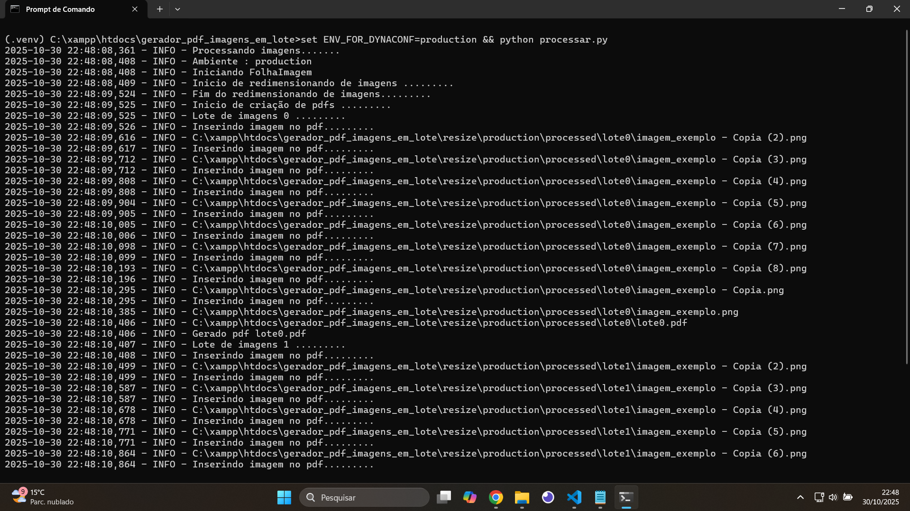
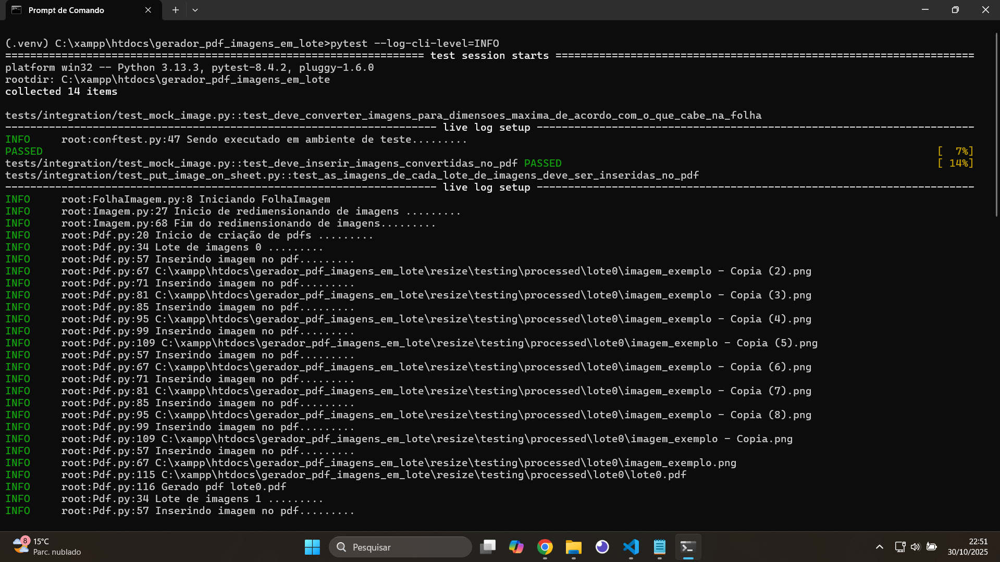

# Processamento de Imagens em Lote para Redimensionamento e Inserção automática no PDF para Impressão
Está automação precisou ser desenvolvida para atender a necessidade de um cliente, devido ao grande numero de imagens que foram enviadas para inserção em folha A4, para geração de PDFs, e posteriormente a impressão realizada por conta do cliente, estes scripts se fez necessário para agilizar o trabalho onde este RPA cria todo fluxo desde o recebimento das imagens, passando pelo processo de redimensionamento e inserção em folha A4 de forma automática reduzindo o tempo que seria gasto se fosse realizado de forma manual.

## Funcionalidades
- O script redimensiona as imagens antes da inserção em folha `A4`
- O script gera automaticamente pdfs por lotes de imagens adicionadas na pasta `process`
- O script insere 4 imagens por folha na execução padrão, podendo alternar para 2 ou até 6 imagens por folha com opções personalizadas.
- Permite ajuste pelo terminal de opções das dimensões geradas das imagens

# Testes

Todo densenvolvimento do RPA foi realizado orientado a testes(TDD - Test-Driven Development), foi realizado diversos testes desde teste de simulação(mocks), passando por testes unitários até testes de integração que cobre todo o fluxo para geração dos pdfs da imagens adicionada para processamento em lote.

[](assets/testes.png)

# Instale as dependências

Crie uma ambiente virtual na raiz do projeto adicionando a pasta `.venv`

Ative o ambiente virtual. E instale as dependências do projeto com o seguinte comando :

```sh

    pip install -r requirements.txt

```

# Execução do RPA

Crie uma pasta chamada `production/process`e salve suas imagens em lote(pastas) dentro da pasta `production/process` confome hierarquia abaixo.

```sh

gerador_pdf_imagens_em_lote/
│
├── resize/ 
    ├── production
        ├── received/                # Onde ficam as imagens brutas recebidas pelos clientes que não são modificadas.
        │   ├── lote0/
        │   │   ├── imagem_exemplo.png
        │   │   └── imagem_exemplo - Copia.png
        │   └── lote1/
        │       ├── imagem_exemplo.png
        │       └── imagem_exemplo - Copia.png
        ├── process/                # Onde as imagens são guardadas para serem processadas(redimensionamento e inserção no pdf) que podem ser organizadas.
        │   ├── lote0/
        │   │   ├── imagem_exemplo.png
        │   │   └── imagem_exemplo - Copia.png
        │   └── lote1/
        │       ├── imagem_exemplo.png
        │       └── imagem_exemplo - Copia.png
        ├── processed/              # Onde ficam os resultados finais (PDFs e imagens geradas)
        │   ├── lote0/
        │   │   ├── lote0.pdf       # PDF final gerado com as imagens do lote
        │   │   ├── imagem_exemplo.jpg        # Capturas de tela ou imagens intermediárias de verificação
        │   │   └── imagem_exemplo - Copia.jpg
        │   └── lote1/
        │       ├── lote1.pdf
        │       ├── imagem_exemplo.jpg
        │       └── imagem_exemplo - Copia.jpg

```

Para executar o RPA em modo produção execute o seguinte comando :

```sh

    set ENV_FOR_DYNACONF=production && python processar.py

```

O script começará a processar as imagens fazendo o redimensionamento e inserção automática em folha A4 para impressão.

[](assets/processamento_imagens_pdf.png)

# PDF Gerado
[](assets/folha_a4_com_imagens.png)

# Execução do RPA com parâmetros

Por padrão é gerado 4 imagens por folha. Mas você pode personalizar as quantidade de imagens por folha, sendo 2, 4 ou até 6 imagens e
também pode ser ajustado as dimensões geradas das imagens na folha com comandos personalizados.

Utilize a ajuda para ver mais detalhes.

```sh

    python processar.py --help

```
[](assets/ajuda.png)

## Personalizando duas imagens por folha

```sh

    set ENV_FOR_DYNACONF=production && python processar.py --qtd-imagens-por-folha="2" --ajuste-witdh=0.5

```

[](assets/duas_imagens_por_pagina.png)

## Personalizando seis imagens por folha

```sh

    set ENV_FOR_DYNACONF=production && python processar.py --qtd-imagens-por-folha=6 --ajuste-width=0.6

```

[](assets/6_imagens_por_pagina.png)


# Testes automatizados

Para execução dos testes automatizados execute o seguinte comando na raiz do projeto :

```sh

    pytest

```

[](assets/pytest.png)

Para execução com logs, execute o seguinte comando :

```sh

    pytest --log-cli-level=INFO

```

[](assets/pytest_with_logs.png)

# Fluxo e Ambientes de desenvolvimento x teste x produção

Os ambientes estão sendo gerenciados por Dynaconf fazendo que ambientes fiquem centralizados em um único local podendo alternar rapidamente o gerador de pdf de imagens redimensionadas em lote para os seguintes ambientes : desenvolvimento, testes ou produção.

## Ambiente de desenvolvimento

Ao executar o script com o comando `set ENV_FOR_DYNACONF=development && python processar.py`, o script usará como base a pasta `resize/development`, onde considera que todas imagens a serem processadas estarão na pasta `resize/development/process` para serem colocadas no pdf. Esta estrutura de pasta não é enviada para o git por padrão. por favor crie a estrutura e salve as imagens de desenvolvimento nas pastas `received/process` para serem processadas conforme modelo abaixo.

## Ambiente de testes

Ao executar os testes com o comando `pytest`, o ambiente será alterado automaticamente para testing, ou seja, todas as imagens processadas são salvas na pasta `resize/testing/processed`. Porém ao final do teste elas são removidas pela fixture `criar_lotes_imagens` dexando a pasta limpa novamente.


## Ambiente de Produção

Ao executar o script com o comando `set ENV_FOR_DYNACONF=production && python processar.py` o script usará como base a pasta `resize/production` onde devem estar na subpasta `process` todas as imagens dos clientes que serão processadas e colocadas no pdf. Esta pasta não é enviada para o git por padrão, por favor crie a estrutura e salve as imagens dos clientes nas pastas `received/process` para serem processadas conforme modelo abaixo.

## Modelo de pastas
O modelo de pastas será sempre o mesmo independente do ambiente que está sendo executado. Crie o mesmo modelo para todos os ambientes alterando apenas o nome de uma pasta conforme detalhe abaixo.

```sh

gerador_pdf_imagens_em_lote/
│
├── resize/ 
    ├── production                   # Detalhe : O nome da pasta aqui pode varia dependendo do ambiente que está sendo executado (production,testing ou development)
        ├── received/                # Onde ficam as imagens brutas recebidas pelos clientes que não são modificadas.
        │   ├── lote0/
        │   │   ├── imagem_exemplo.png
        │   │   └── imagem_exemplo - Copia.png
        │   └── lote1/
        │       ├── imagem_exemplo.png
        │       └── imagem_exemplo - Copia.png
        ├── process/                # Onde as imagens são guardadas para serem processadas(redimensionamento e inserção no pdf) que podem ser organizadas.
        │   ├── lote0/
        │   │   ├── imagem_exemplo.png
        │   │   └── imagem_exemplo - Copia.png
        │   └── lote1/
        │       ├── imagem_exemplo.png
        │       └── imagem_exemplo - Copia.png
        ├── processed/              # Onde ficam os resultados finais (PDFs e imagens geradas)
        │   ├── lote0/
        │   │   ├── lote0.pdf       # PDF final gerado com as imagens do lote
        │   │   ├── imagem_exemplo.jpg        # Capturas de tela ou imagens intermediárias de verificação
        │   │   └── imagem_exemplo - Copia.jpg
        │   └── lote1/
        │       ├── lote1.pdf
        │       ├── imagem_exemplo.jpg
        │       └── imagem_exemplo - Copia.jpg

```

# Modo Debug

Ao executar os script `processar.py` nos ambientes de `testing ou development`, o modo debugging é ativado automaticamente devido a configuração feita no arquivo `settings.toml`, onde os ambientes `[development] e [testing]` já estão setados `DEBUG = true`. Assim você terá uma visão mais ampla do processamento do arquivo.

[](assets/processamento_em_modo_debug.png)

# Principais conceitos aplicados

- Entendimento do problema e desenvolvimento de uma solução simples
- Desenvolvimento baseado em TDD(Test-Driven Development)
- Desenvolvimento baseado em um fluxo simples criado para o RPA, Recebimento das imagens enviadas pelo cliente->Processamento(Redimensionamento e Inserção no Pdf)->Geração de PDFs
- Implementação de logs com a classe `logging`.
- Trabalhando com manipulação de arquivos
- Trabalhando com variaves de ambiente com gerenciamento por Dynaconf
- Entendendo a diferença de carregar variaveis de ambientes como a class `os` x `Dynaconf`
- Bibilotecas
- - Pillow
- - ReportLab
- - Dynaconf
- - Pytest
- Trabalhando com injeção de dependência
- Testes automatizados com Pytest
- - Testes com simulação(mocks)
- - Teste unitários
- - Testes de Integração
- Criação do arquivo de entrada processar.py para execução do RPA.
- Trabalhando com a classe `argparse` para criar opções customizadas ao executar o RPA.
- Trabalhando com a criação de opções customizadas para o pytest com a fixture `parser`
- - Opção de executar testes com processamento de 2, 4 ou 6 imagens por folha com a flag `--qtd-imagens-por-folha`
- - Opção de executar testes com ajuste de imagens no comprimento com a flag `--ajuste-width`
- - Opção de executar testes com ajuste de imagens na altura com a flag `--ajuste-height`
- - Opção de executar testes com ou sem teardown com a flag `--teardown` para visualização antes da exclusão do pdf gerado.
- Entendo sobre arquivos de configuração `pytest.ini` do pytest


